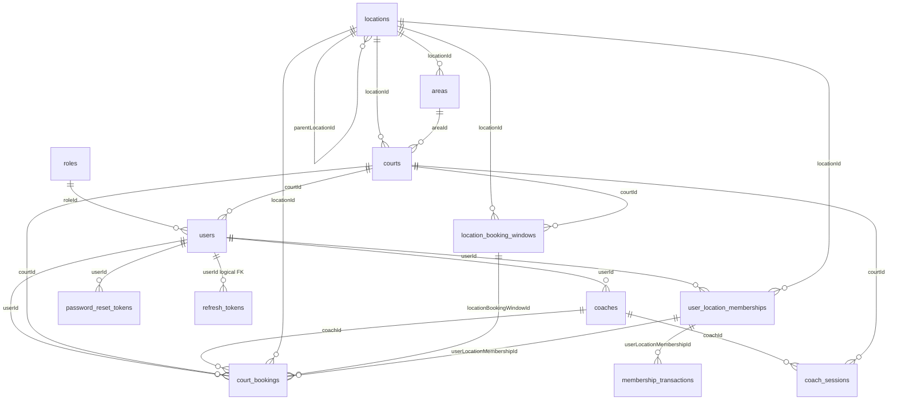

# Database schema (ERD) — **implementation + design notes**

This document tracks the **live** PostgreSQL schema created by TypeORM for the entities registered in `apps/api/src/app.module.ts` and `apps/api/src/database/typeorm-cli.datasource.ts` (same **15** entities). It also documents **product rules**, **FK / `onDelete` behavior**, and **future** ideas (exclusion constraints, heavier async use of `booking_commands`).

The booking product centers on **locations** (optional **parent/child** hierarchy via `parentLocationId` / `kind`), **areas** under a location, **multi-sport courts** (`courts.sports[]`, `courts.courtTypes[]`), **public vs private locations** with **memberships**, and a **slot-first court booking flow** at `/locations/:id/courts` (see §1.4).

### Entities in the repo but **not** registered with TypeORM

| Entity file | Table name | Status |
|-------------|------------|--------|
| `organizations/entities/organization.entity.ts` | `organizations` | **Not** in `AppModule` / CLI datasource — no sync/migrations from this app unless you add it |
| `branches/entities/branch.entity.ts` | `branches` | Same |

If those tables exist in a database, they are from older setups or manual SQL; the **current** Nest API does not map them.

> Use **migrations** in production when `DB_SYNC=false`. **Column names** below follow **camelCase** as in TypeORM (default naming); Postgres may show lowercase unquoted identifiers.

---

## 1. Business rules (summary)

### 1.1 Locations: `public` vs `private`

| Kind | Who can book | Membership |
|------|----------------|------------|
| **Public** | Any authenticated user (subject to your auth rules) | Not required |
| **Private** | Only users with an **active** membership **at that location** | One-time **initiation fee** + recurring **monthly fee** to stay active |

Members at a **private** location receive **court booking discounts** (configurable per location; see `locations` and `court_bookings` pricing fields).

### 1.2 User profile

- **Phone number:** required on the `users` row (OAuth may use a placeholder until profile completion).
- **Home address:** optional (`homeAddress` text).

### 1.3 Booking UI flow (location courts page)

**Do not** render a flat grid of all courts as the primary path. The **implemented** UI uses a compact **single-page** flow (see §1.4). A **stepped** alternative (dropdowns, explicit court pick) remains a valid product pattern using the same APIs.

### 1.4 Implemented flow: slot grid + auto court (location courts page)

The **live** customer UI at `/locations/:locationId/courts` uses a **slot-first** variant:

1. **Activity** — horizontal **pills** for each sport available at the venue (order e.g. Tennis → Pickleball → Ball machine), aligned with `courts.sports[]` (and `sports` catalog).
2. **Indoor / outdoor** — **pills** aligned with `courts.courtTypes[]` (booking rows store `courtType` snapshot).
3. **Duration** — pills (`30` / `60` / `90` minutes) matching policy.
4. **Date** — single-day picker; “today” and cutoffs use `locations.timezone` (IANA).
5. **Slots** — `GET /bookings/court/wizard/slots` returns aggregated intervals with `availableCount` / `totalCount` across all matching courts (no per-court names in the grid).
6. **Soft holds** — WebSocket room per location; clients signal holds on an interval so capacity updates for overlapping durations.
7. **Book** — `POST /bookings/court/slot` picks a **random free court** for that interval; `court_bookings` rows store denormalized `locationId`, `sport`, `courtType` for lists and analytics.
8. **Reschedule (same row)** — `PATCH /bookings/court/slot/:bookingId` with the same body shape as (7) updates that booking’s time/court/pricing; only `COURT_ONLY` without coach. Slot grid can pass `excludeBookingId` on `GET /bookings/court/wizard/slots` so the user’s current booking does not count as “busy” while choosing a new slot.

**Layout:** full-width page with **booking controls on the left** and a **“Hi {name}, your bookings”** sidebar on the right. Data comes from `GET /bookings/my` (scoped to the user), filtered client-side by `locationId`. **Cancel** uses `DELETE /bookings/court/:id`. **Change time** pre-fills the left form and switches the primary action to **Update now**, calling **PATCH** so no second row is inserted. **Success** is shown with a **toast** (no redirect to booking history).

**Admin calendar / series:** `court_bookings.adminCalendarSeriesId` stores a shared UUID across rows created from one admin multi-date or recurring submit, supporting cancel-by-series in booking handlers.

### 1.5 Admin analytics dashboard (read model)

The **admin home** at `/admin` shows **operations analytics** (KPI cards + charts). Data sources:

| Mode | Source |
|------|--------|
| **Real** | `GET /admin/dashboard/metrics` (JWT + role `admin` \| `super_admin`). Aggregates from `users`, `courts`, `locations`, `court_bookings`, `coach_sessions`, `coaches`. |
| **Mockup** | Static JSON in the frontend for demos / design reviews when DB is empty or offline. |

**Metrics semantics (aligned with code in `AdminService`):**

| Series | Window / filter |
|--------|------------------|
| `dailyCourtBookings` | Rolling **14 calendar days** on `court_bookings.bookingDate` (inclusive from “today − 13” through today, using the same UTC date string as the query), **`bookingStatus` ≠ `cancelled`**. |
| `dailyRevenue` | Same date window; per-day **sum** of `court_bookings.totalPrice`. |
| `totals.revenue14d` | Sum of `dailyRevenue` over that window. |
| `bookingsBySport` | **Same 14-day window** and non-cancelled filter as the daily charts; grouped by `COALESCE(court_bookings.sport, 'unknown')`. |
| KPI “Open court bookings” | Count of rows with `bookingStatus` ∈ {`pending`, `confirmed`} (not tied to the 14-day window). |
| KPI “Coach sessions (scheduled)” | `coach_sessions` with `status = scheduled`. |

**Drill-down (UI):** clicking a bar in **By sport** opens a right-hand panel. **Real** data: `GET /admin/dashboard/metrics/by-sport?sport=<key>` returns counts for that sport in the **same 14-day window**, grouped by **booker role name** (`users` → `roles`), **`court_bookings.bookingType`** (`COURT_ONLY` \| `COURT_COACH`), and **`users.accountType`** (`normal` \| `membership` \| `system`). Use `sport=unknown` for the “Other” bucket (null/empty `sport` on rows).

**Further drill-down (lists):**

| Endpoint | Purpose |
|----------|---------|
| `GET /admin/dashboard/metrics/by-sport/drilldown?sport=&dimension=&value=&page=&pageSize=` | **Distinct bookers** in that 14-day sport slice with **per-user booking counts**, filtered by `dimension` = `role` \| `bookingType` \| `accountType` and the matching `value` (role label / enum / account type). Paginated. |
| `GET /admin/dashboard/metrics/kpi-drilldown?metric=&page=&pageSize=` | Rows behind a **KPI tile** (`usersActive`, `courts`, `locations`, `courtBookingsOpen`, `coachSessionsScheduled`, `coaches`, `revenue14d`). Paginated. |
| `GET /admin/dashboard/metrics/day-bookings?date=YYYY-MM-DD&page=&pageSize=` | **Non-cancelled** `court_bookings` on one **calendar day** (for chart point clicks). Paginated. |

These routes are **read-only** and reuse existing tables (`users`, `courts`, `locations`, `court_bookings`, `coach_sessions`, `coaches`, `roles`). Admin booking management remains `GET /admin/bookings` (see admin app).

---

## 2. Summary counts

| Metric | Count | Notes |
|--------|------:|-------|
| **Tables synced by current API** | **15** | Registered in `AppModule` and `typeorm-cli.datasource.ts` (§7) |
| **Entity files not registered** | **2** | `organizations`, `branches` — see intro |
| **Optional / future patterns** | — | Stronger use of `booking_commands` + workers; exclusion constraints on `court_bookings` (§4) |

---

## 3. Availability algorithm (slots & court dropdown)

**Inputs:** `locationId`, `sport`, `courtType` (`indoor`|`outdoor`), `bookingDate`, optional `windowId`, `durationMinutes`.

**Steps:**

1. **Load candidate courts**  
   `SELECT` from `courts` where `locationId` matches, `status = 'active'`, and the chosen **sport** is contained in `courts.sports` (text[]) and **court type** (indoor/outdoor) is contained in `courts.courtTypes` (text[]).

2. **Load time window**  
   From `location_booking_windows` for that location (and matching `sport` / `courtType` if columns are scoped). Window defines `[windowStartTime, windowEndTime]` on the chosen **calendar day** (local timezone of the location — `locations.timezone`).

3. **Generate candidate slot starts**  
   Step from `windowStart` by **slot grid** (`slotGridMinutes`) up to `windowEnd - duration`. For each start `S`, slot is `[S, S + duration)`.

4. **Subtract existing bookings**  
   For each court, load `court_bookings` for `bookingDate` with `bookingStatus` not `cancelled` and overlapping time ranges. A slot is **free** if it does not intersect any booking.

5. **Build API response**  
   - List of **windows** + **durations** allowed.  
   - For selected window + duration: list **concrete slots** (start–end).  
   - **Aggregated slot API:** counts across courts (`CourtWizardAvailabilityService`).

**Indexes (entity):** `court_bookings` has a composite index on `(courtId, bookingDate)` (`@Index` on `CourtBooking`).

**Timezone:** `bookingDate` is `date`; wall times `startTime` / `endTime`; UTC instants `bookingStartAt` / `bookingEndAt` for overlap and APIs.

---

## 4. Concurrency: many users, same day — queues & “who wins”

**Problem:** Many users may pick the same slot. Only **one** booking should succeed per overlapping interval on a **given court**.

### 4.1 Source of truth (recommended)

Use the **database** as the authority:

- **Exclusion constraint** on `tstzrange(bookingStartAt, bookingEndAt)` per `courtId` (Postgres GiST), or  
- **Unique** `(courtId, bookingDate, startTime)` if all bookings snap to a fixed grid.

On conflict: return **409** / “Slot just taken”.

### 4.2 Where message queues fit

A queue does **not** replace the DB constraint. Use it for ordering, peak load (enqueue then worker `INSERT`), and **side effects** (email, payment) **after** commit.

### 4.3 Table `booking_commands` (implemented)

Async / idempotency ledger; **actual** columns (see §8):

| Column | Purpose |
|--------|---------|
| `id` | UUID PK |
| `idempotencyKey` | **Unique** — prevents duplicate work |
| `userId` | Booker |
| `commandType` | Default `court_booking` |
| `payload` | **jsonb** — flexible slot/court payload for workers |
| `status` | `pending` \| `processing` \| `succeeded` \| `failed` |
| `failureReason` | Nullable text |
| `resultCourtBookingId` | Nullable — links to created `court_bookings.id` when succeeded |
| `createdAt`, `updatedAt`, `processedAt` | Audit |

Workers should still rely on **`court_bookings` uniqueness / transactions**; see `docs/BOOKING_CONCURRENCY_AND_QUEUE.md` if present.

---

## 5. Membership & money history

- **`user_location_memberships`** — state per `(userId, locationId)` with **unique** constraint on that pair.
- **`membership_transactions`** — append-only style ledger (`type`, `amountCents`, `currency`, optional `periodLabel`, `externalPaymentId`, `metadata` jsonb).

Optional FK from `court_bookings.userLocationMembershipId` when member pricing applies.

---

## 6. Admin: “orders” vs `bookings/my`

| Question | Answer |
|----------|--------|
| Is `GET .../bookings/my` enough for admin? | **No.** Scoped to the authenticated user. |
| Need an **`orders` table?** | **Not required** for court-only flows; each `court_bookings` row is the line item. `coach_sessions` is analogous for coach products. |
| What should admin use for analytics? | **`GET /admin/dashboard/metrics`** (§1.5). |
| When add `orders`? | Multi-line checkout, single payment intent, unified order status across line types → `orders` + `order_lines`. |

---

## 7. Tables — registered entities (TypeORM)

| # | Table | Entity class | Purpose |
|---|--------|--------------|---------|
| 1 | `locations` | `Location` | Facility tree (`parentLocationId`, `kind`), timezone, public/private, membership pricing, `memberCourtPriceBasis` |
| 2 | `areas` | `Area` | Sub-venue under a location |
| 3 | `location_booking_windows` | `LocationBookingWindow` | Per location (+ optional `courtId`) windows: sport, court type, times, durations JSON, slot grid |
| 4 | `courts` | `Court` | Bookable unit; `locationId`, optional `areaId`, `sports[]`, `courtTypes[]`, rates, media |
| 5 | `sports` | `Sport` | Catalog (`code` unique, `name`, …) |
| 6 | `roles` | `Role` | RBAC; `name` unique; `permissions` CSV string |
| 7 | `users` | `User` | Accounts; `roleId`, `accountType`, optional `courtId`, `visibility`, OAuth |
| 8 | `user_location_memberships` | `UserLocationMembership` | Membership state per user + location |
| 9 | `membership_transactions` | `MembershipTransaction` | Money history for a membership |
| 10 | `coaches` | `Coach` | Coach profile linked to `users` |
| 11 | `court_bookings` | `CourtBooking` | Court reservations; pricing snapshots; UTC interval; admin series id |
| 12 | `coach_sessions` | `CoachSession` | Coach sessions; optional `locationId`, `courtId`, `bookedById` |
| 13 | `password_reset_tokens` | `PasswordResetToken` | One-time reset tokens |
| 14 | `refresh_tokens` | `RefreshToken` | Hashed refresh tokens per `userId` |
| 15 | `booking_commands` | `BookingCommand` | Idempotency / async command state |

---

## 8. Table columns (reference — aligned with entities)

### `locations`

| Column | Type | Nullable | Notes |
|--------|------|----------|--------|
| `id` | uuid | No | PK |
| `parentLocationId` | uuid | Yes | Self-FK; tree root / child |
| `kind` | varchar | No | `root` \| `child` (default **`child`** in entity) |
| `name` | varchar | No | |
| `address` | varchar | Yes | |
| `latitude`, `longitude` | decimal(10,7) | Yes | Map center |
| `mapMarkers` | text | Yes | JSON array of markers |
| `timezone` | varchar | No | IANA (default `America/Chicago`) |
| `visibility` | varchar | No | `public` \| `private` |
| `membershipInitiationFeeCents` | int | No | Default `0` |
| `membershipMonthlyFeeCents` | int | No | Default `0` |
| `memberCourtDiscountPercent` | int | No | `0–100` |
| `memberCourtPriceBasis` | varchar | No | `discount_from_public` \| `fixed_member_rate` |
| `status` | varchar | No | e.g. `active` \| `inactive` |
| `createdAt`, `updatedAt` | timestamp | No | |

**Relations:** `parentLocation` (ManyToOne self), `children` (OneToMany).

---

### `location_booking_windows`

| Column | Type | Nullable | Notes |
|--------|------|----------|--------|
| `id` | uuid | No | PK |
| `locationId` | uuid | No | FK → `locations` **CASCADE** |
| `courtId` | uuid | Yes | FK → `courts` **CASCADE**; null = location-level row |
| `sport` | varchar | No | e.g. `tennis`, `pickleball` |
| `courtType` | varchar | No | `indoor` \| `outdoor` |
| `windowStartTime`, `windowEndTime` | time | No | Local wall clock |
| `allowedDurationMinutes` | text | No | JSON array string e.g. `"[30,60,90]"` |
| `slotGridMinutes` | int | No | Default `30` |
| `sortOrder` | int | No | Default `0` |
| `isActive` | boolean | No | Default `true` |
| `createdAt`, `updatedAt` | timestamp | No | |

---

### `areas`

| Column | Type | Nullable | Notes |
|--------|------|----------|--------|
| `id` | uuid | No | PK |
| `locationId` | uuid | No | FK → `locations` **CASCADE** |
| `name` | varchar | No | |
| `description` | varchar | Yes | |
| `status` | varchar | No | Default `active` |
| `visibility` | varchar | No | `public` \| `private` |
| `createdAt`, `updatedAt` | timestamp | No | |

---

### `courts`

| Column | Type | Nullable | Notes |
|--------|------|----------|--------|
| `id` | uuid | No | PK |
| `locationId` | varchar | Yes | FK → `locations` **SET NULL** (column type varchar in entity) |
| `areaId` | uuid | Yes | FK → `areas` **SET NULL** |
| `name` | varchar | No | |
| `courtTypes` | varchar[] | No | Default `{outdoor}` |
| `sports` | varchar[] | No | Default `{tennis}` |
| `pricePerHourPublic` | decimal(12,2) | No | Default `0` |
| `pricePerHourMember` | decimal(12,2) | Yes | Override member hourly; null = use location discount rule |
| `description` | text | Yes | |
| `imageUrl` | varchar | Yes | |
| `imageGallery` | text | Yes | JSON gallery |
| `mapEmbedUrl` | text | Yes | |
| `status` | varchar | No | Default `active` (e.g. `maintenance`) |
| `createdAt`, `updatedAt` | timestamp | No | |

---

### `sports`

| Column | Type | Nullable | Notes |
|--------|------|----------|--------|
| `id` | uuid | No | PK |
| `code` | varchar | No | **Unique** e.g. `tennis` |
| `name` | varchar | No | |
| `description` | varchar | Yes | |
| `imageUrl` | varchar | Yes | |
| `createdAt`, `updatedAt` | timestamp | No | |

---

### `roles`

| Column | Type | Nullable | Notes |
|--------|------|----------|--------|
| `id` | uuid | No | PK |
| `name` | varchar | No | **Unique** |
| `description` | varchar | Yes | |
| `permissions` | varchar | Yes | CSV codes; default `""` |
| `createdAt`, `updatedAt` | timestamp | No | |

---

### `users`

| Column | Type | Nullable | Notes |
|--------|------|----------|--------|
| `id` | uuid | No | PK |
| `roleId` | uuid | Yes | FK → `roles`; user loads role **eager** |
| `email` | varchar | No | **Globally unique** |
| `passwordHash` | varchar | Yes | Null for OAuth-only until set |
| `fullName` | varchar | No | |
| `firstName`, `lastName` | varchar | Yes | |
| `phone` | varchar | No | |
| `homeAddress` | text | Yes | |
| `avatarUrl` | varchar | Yes | |
| `status` | varchar | No | Default `active` |
| `mustChangePasswordOnFirstLogin` | boolean | No | Default `false` |
| `googleId` | varchar | Yes | |
| `courtId` | uuid | Yes | FK → `courts` **SET NULL** — staff/coach primary court |
| `visibility` | varchar(16) | No | `public` \| `private` (directory) |
| `accountType` | varchar(32) | No | `system` \| `normal` \| `membership` |
| `createdAt`, `updatedAt` | timestamp | No | |

---

### `user_location_memberships`

| Column | Type | Nullable | Notes |
|--------|------|----------|--------|
| `id` | uuid | No | PK |
| `userId` | uuid | No | FK → `users` **CASCADE** |
| `locationId` | uuid | No | FK → `locations` **CASCADE** |
| `status` | varchar | No | `pending_payment` \| `active` \| `grace` \| `lapsed` \| `cancelled` |
| `initiationPaidAt` | timestamptz | Yes | |
| `currentPeriodStart`, `currentPeriodEnd` | date | Yes | |
| `lastMonthlyPaidAt` | timestamptz | Yes | |
| `cancelledAt` | timestamptz | Yes | |
| `createdAt`, `updatedAt` | timestamp | No | |

**Constraint:** **Unique** `(userId, locationId)`.

---

### `membership_transactions`

| Column | Type | Nullable | Notes |
|--------|------|----------|--------|
| `id` | uuid | No | PK |
| `userLocationMembershipId` | uuid | No | FK → `user_location_memberships` **CASCADE** |
| `type` | varchar | No | `initiation` \| `monthly` \| `refund` \| `adjustment` \| `promo` |
| `amountCents` | int | No | |
| `currency` | varchar(8) | No | Default `USD` |
| `periodLabel` | varchar | Yes | e.g. `2026-03` |
| `externalPaymentId` | varchar | Yes | |
| `metadata` | jsonb | Yes | |
| `createdAt` | timestamptz | No | **No** `updatedAt` on entity |

---

### `coaches`

| Column | Type | Nullable | Notes |
|--------|------|----------|--------|
| `id` | uuid | No | PK |
| `userId` | uuid | No | FK → `users` **CASCADE** |
| `experienceYears` | int | No | Default `0` |
| `bio` | text | Yes | |
| `hourlyRate` | decimal(12,2) | No | Default `0` |
| `createdAt`, `updatedAt` | timestamp | No | |

---

### `court_bookings`

| Column | Type | Nullable | Notes |
|--------|------|----------|--------|
| `id` | uuid | No | PK |
| `locationId` | uuid | Yes | FK → `locations` **SET NULL**; denormalized for filters |
| `sport`, `courtType` | varchar | Yes | Snapshots |
| `locationBookingWindowId` | uuid | Yes | FK → `location_booking_windows` **SET NULL** |
| `adminCalendarSeriesId` | uuid | Yes | Admin batch / recurring series |
| `pricingTier` | varchar | No | `public` \| `member` |
| `unitPricePerHourSnapshot` | decimal(12,2) | Yes | |
| `discountAmount` | decimal(12,2) | Yes | |
| `userLocationMembershipId` | uuid | Yes | FK → `user_location_memberships` **SET NULL** |
| `bookingStartAt`, `bookingEndAt` | timestamptz | Yes | UTC interval |
| `courtId` | uuid | No | FK → `courts` **CASCADE** |
| `userId` | uuid | No | FK → `users` **CASCADE** |
| `coachId` | varchar | Yes | FK → `coaches` **SET NULL** (coach optional) |
| `bookingType` | varchar | No | `COURT_ONLY` \| `COURT_COACH` |
| `bookingDate` | date | No | |
| `startTime`, `endTime` | time | No | |
| `durationMinutes` | int | No | |
| `totalPrice` | decimal(12,2) | No | Default `0` |
| `paymentStatus` | varchar | No | `unpaid` \| `paid` \| `refunded` |
| `bookingStatus` | varchar | No | `pending` \| `confirmed` \| `cancelled` \| `completed` |
| `reminder30EmailSentAt` | timestamptz | Yes | |
| `createdAt`, `updatedAt` | timestamp | No | |

**Index:** `(courtId, bookingDate)`.

---

### `coach_sessions`

| Column | Type | Nullable | Notes |
|--------|------|----------|--------|
| `id` | uuid | No | PK |
| `locationId` | uuid | Yes | **No** TypeORM relation to `locations` — app must keep consistent |
| `coachId` | uuid | No | FK → `coaches` **CASCADE** |
| `bookedById` | varchar | Yes | User id who booked (no FK relation in entity) |
| `courtId` | varchar | Yes | FK → `courts` **SET NULL** |
| `sessionDate` | date | No | |
| `startTime` | time | No | |
| `durationMinutes` | int | No | End time derived in app if needed |
| `sessionType` | varchar | No | `private` \| `group` |
| `status` | varchar | No | `scheduled` \| `completed` \| `cancelled` |
| `createdAt`, `updatedAt` | timestamp | No | |

---

### `password_reset_tokens`

| Column | Type | Nullable | Notes |
|--------|------|----------|--------|
| `id` | uuid | No | PK |
| `userId` | uuid | No | FK → `users` **CASCADE** |
| `token` | varchar | No | **Unique** |
| `expiresAt` | timestamp | No | |
| `used` | boolean | No | Default `false` |
| `createdAt` | timestamp | No | |

---

### `refresh_tokens`

| Column | Type | Nullable | Notes |
|--------|------|----------|--------|
| `id` | uuid | No | PK |
| `userId` | uuid | No | **Index**; **no** `ManyToOne` in entity — logical FK only |
| `tokenHash` | varchar | No | **Unique** (SHA-256 of opaque token) |
| `expiresAt` | timestamptz | No | |
| `longSession` | boolean | No | “Remember me” |
| `createdAt` | timestamptz | No | |

---

### `booking_commands`

| Column | Type | Nullable | Notes |
|--------|------|----------|--------|
| `id` | uuid | No | PK |
| `idempotencyKey` | varchar | No | **Unique** |
| `userId` | varchar | No | No FK relation in entity |
| `commandType` | varchar | No | Default `court_booking` |
| `payload` | jsonb | No | Worker payload |
| `status` | varchar | No | `pending` \| `processing` \| `succeeded` \| `failed` |
| `failureReason` | text | Yes | |
| `resultCourtBookingId` | uuid | Yes | Created booking id |
| `createdAt`, `updatedAt` | timestamp | No | |
| `processedAt` | timestamptz | Yes | |

---

### `organizations` / `branches` (files only — not registered)

**`organizations`:** `id`, `name`, `description`, `status`, `createdAt`, `updatedAt`.

**`branches`:** `id`, `organizationId` (varchar, nullable), `name`, `address`, `phone`, `createdAt`, `updatedAt` — no TypeORM relation to `organizations` in the entity file.

---

## 9. FK summary (`onDelete`)

| From | To | onDelete |
|------|-----|----------|
| `location_booking_windows.locationId` | `locations` | CASCADE |
| `location_booking_windows.courtId` | `courts` | CASCADE |
| `areas.locationId` | `locations` | CASCADE |
| `courts.locationId` | `locations` | SET NULL |
| `courts.areaId` | `areas` | SET NULL |
| `users.roleId` | `roles` | (nullable) |
| `users.courtId` | `courts` | SET NULL |
| `user_location_memberships` | `users`, `locations` | CASCADE |
| `membership_transactions` | `user_location_memberships` | CASCADE |
| `coaches.userId` | `users` | CASCADE |
| `court_bookings.courtId` | `courts` | CASCADE |
| `court_bookings.userId` | `users` | CASCADE |
| `court_bookings.coachId` | `coaches` | SET NULL |
| `court_bookings.locationId` | `locations` | SET NULL |
| `court_bookings.locationBookingWindowId` | `location_booking_windows` | SET NULL |
| `court_bookings.userLocationMembershipId` | `user_location_memberships` | SET NULL |
| `coach_sessions.coachId` | `coaches` | CASCADE |
| `coach_sessions.courtId` | `courts` | SET NULL |
| `password_reset_tokens.userId` | `users` | CASCADE |
| `locations.parentLocationId` | `locations` | SET NULL |

---

## 10. High-level ERD (text)

```
locations (self: parentLocationId, kind root|child)
     ├── areas
     └── courts (→ optional area; sports[], courtTypes[])
              └── location_booking_windows (location + optional court)

user_location_memberships ── membership_transactions

users ──┬── court_bookings (→ courts, users; optional coach, location, window, membership)
        ├── coach_sessions (→ coach, optional court; locationId, bookedById columns)
        ├── coaches (1:1-style profile via userId)
        ├── password_reset_tokens
        └── refresh_tokens (userId, no ORM relation)

roles ← users.roleId
sports (catalog; not FK-linked from courts — courts use text[] codes)

booking_commands (standalone command ledger)

Unregistered in app: organizations, branches (entity files only)
```

---

## 11. Mermaid ERD (overview)



`booking_commands` references `userId` without a TypeORM relation; treat as a logical link to `users` if you extend the diagram.

---

## 12. Implementation notes

- **Migrations:** `apps/api/src/database/migrations/*.ts`; keep entities and migrations aligned.
- **Registering `organizations` / `branches`:** Add to `app.module.ts` and `typeorm-cli.datasource.ts` if you need those tables under TypeORM.
- **Recommended hardening:** Postgres exclusion constraint or unique rule on court time ranges for `court_bookings` (§4.1).

---

## 13. Legacy reference

Older inventories that counted **17** tables by including `organizations` and `branches` as “live” are **superseded**: those two are **not** registered in the current API. Always diff `**/*.entity.ts` against §7–§8 when changing the schema.
