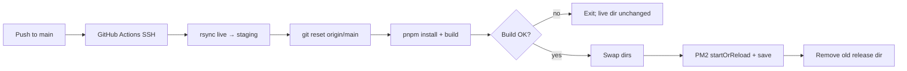

# Deployment (CI/CD)

This document describes how production deployments run for the Nest API: **GitHub Actions** triggers an **SSH** session on **EC2**, which builds in a **staging copy** of the app and **atomically swaps** directories before reloading **PM2**.

## Overview

| Item | Detail |
|------|--------|
| **Workflow file** | [.github/workflows/deploy.yml](../.github/workflows/deploy.yml) |
| **Trigger** | Push to `main` |
| **Runner** | `ubuntu-latest` (GitHub-hosted) |
| **Target** | Single EC2 instance (`ec2-user`) |
| **Process manager** | PM2 (`ecosystem.config.js`) |
| **App root on server** | `/home/ec2-user/tennis-booking-backend` |

The workflow does **not** build on GitHub Actions. The server performs `git` update, `pnpm install`, `pnpm run build`, and PM2 reload.

## Prerequisites

### GitHub repository secrets

Configure these in **Settings → Secrets and variables → Actions**:

| Secret | Purpose |
|--------|---------|
| `EC2_HOST` | Public hostname or IP of the EC2 instance |
| `EC2_KEY` | Private SSH key (PEM) for `ec2-user` |

The job uses [appleboy/ssh-action](https://github.com/appleboy/ssh-action) to run the remote script.

### EC2 instance setup

The instance should already have:

- **Git** checkout at `/home/ec2-user/tennis-booking-backend` with `origin` pointing at this repository (so `git fetch` / `git reset --hard origin/main` work without embedding the URL in the workflow).
- **Node.js** and **pnpm** (see root `package.json` `engines` / `packageManager`).
- **PM2** installed globally and used with [ecosystem.config.js](../ecosystem.config.js) at the repo root (app entry: `dist/apps/api/src/main.js`).
- **`rsync`** available (used to copy the live tree into a staging directory).

Production **environment variables** live in `.env` on the server (gitignored). They are **not** created by CI; they must exist under the app directory (or be managed another way you document for your team).

## Deployment flow



### Remote steps (in order)

1. **Staging directory** — `${APP_DIR}-new` is removed and recreated, then populated with `rsync` from the live `${APP_DIR}`.
   - **Included:** source, `.git`, and untracked files such as `.env`.
   - **Excluded:** `node_modules`, `dist` (recreated by install/build).

2. **Source update** — `git fetch origin` and `git reset --hard origin/main`. Tracked files match `main`; untracked files (e.g. `.env`) remain.

3. **Install and build** — `pnpm install --frozen-lockfile` and `pnpm run build`.

4. **Validation** — Asserts `dist/apps/api/src/main.js` exists (Nest monorepo output).

5. **Atomic swap** — Removes `${APP_DIR}-old`, moves live `${APP_DIR}` → `${APP_DIR}-old`, moves `${APP_DIR}-new` → `${APP_DIR}`.

6. **PM2** — From the new live directory: `pm2 startOrReload ecosystem.config.js` and `pm2 save`.

7. **Cleanup** — Deletes `${APP_DIR}-old` after a successful reload and save.

If any step fails **before** the swap, the directory serving production is unchanged. If a failure happens **after** the swap but before cleanup, the previous release may still exist at `${APP_DIR}-old` until the script removes it or you clean up manually.

## Rollback (manual)

If the new release is bad and the previous tree still exists at `/home/ec2-user/tennis-booking-backend-old` (for example, the workflow failed after the swap or you restored that folder from backup):

```bash
# On EC2, as ec2-user
APP_DIR=/home/ec2-user/tennis-booking-backend
OLD_DIR=${APP_DIR}-old

pm2 stop tennis-api   # optional; reduces confusion while swapping
rm -rf "${APP_DIR}-bad"
mv "$APP_DIR" "${APP_DIR}-bad"
mv "$OLD_DIR" "$APP_DIR"
cd "$APP_DIR"
pm2 startOrReload ecosystem.config.js
pm2 save
# Remove "${APP_DIR}-bad" after you confirm the app is healthy
```

After a **fully successful** workflow run, `${APP_DIR}-old` is deleted, so this rollback only applies when that directory is still present.

## Troubleshooting

| Symptom | Things to check |
|---------|-----------------|
| SSH fails from Actions | `EC2_HOST`, `EC2_KEY`, security group allows SSH from GitHub IPs (or use a self-hosted runner in the same network). |
| `rsync: command not found` | Install `rsync` on the AMI. |
| `git fetch` / `reset` errors | `origin` URL and credentials on the server (deploy key, HTTPS token, etc.). |
| `pnpm install` fails | Lockfile committed; Node/pnpm versions match `package.json`. |
| Build fails | Same as local `pnpm run build`; fix on a branch before merging to `main`. |
| PM2 starts but app crashes | `.env`, database, Redis, and other runtime deps on EC2. |
| Missing `.env` after changes | Do not run `git clean -fd` blindly in `${APP_DIR}`; it removes untracked files. The copy-and-reset flow preserves `.env` as long as it lives under the app directory before rsync. |

## Related files

- [ecosystem.config.js](../ecosystem.config.js) — PM2 app name, script path, env.
- Root [package.json](../package.json) — `build`, `start:prod`, engine constraints.
